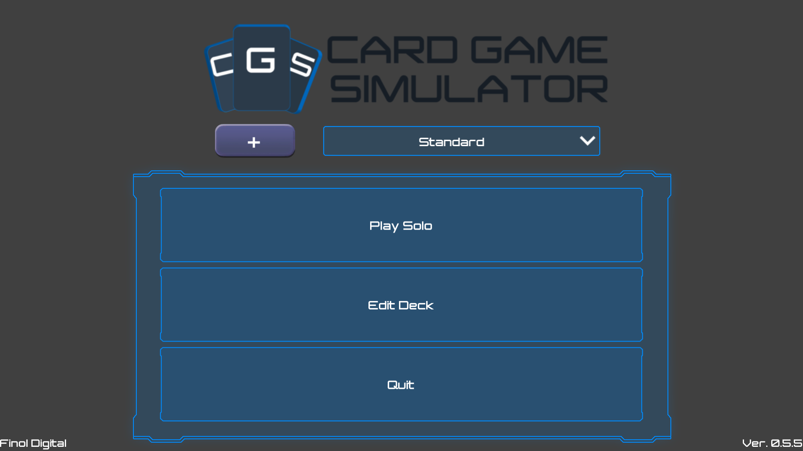

# Card Game Simulator
Included card games:
- Standard Playing Cards
- Dominoes
- Mahjong
- Tarot

Custom card games can be added by pressing the + button on the main menu:

In the resulting popup, type or paste the url that hosts the json for the custom game you would like to download:

You can get an appropriate url from other users, or you can define your own custom game.
To create your own custom games, see [Defining Custom Games](CUSTOMGAMES.md)
