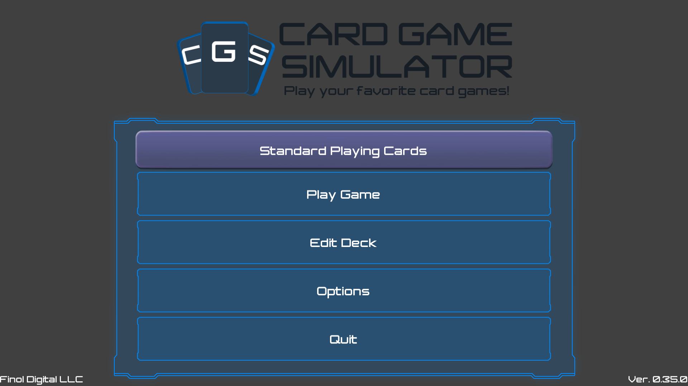
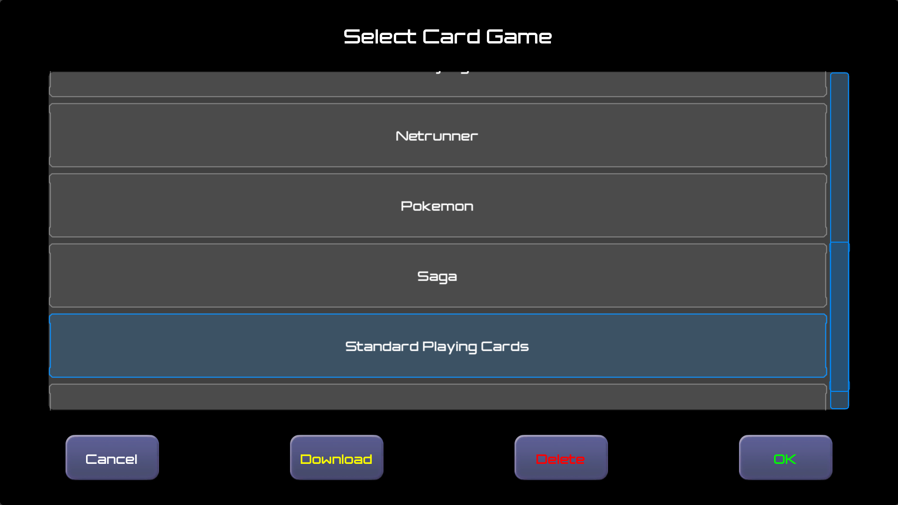
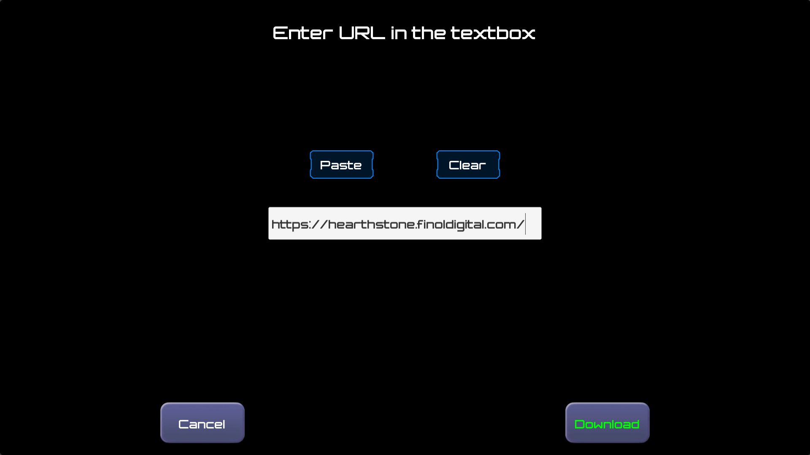

# Get CGS
You can get CGS on your preferred device:
- Android via [Google Play](https://play.google.com/store/apps/details?id=com.finoldigital.cardgamesim)
- iOS via the [App Store](mailto:david@finoldigital.com?subject=GetCGS)
- Mac x64 via [ZIP File](https://drive.google.com/uc?id=1ag7kjPRzweO5O5_Kj7q_yCj7xVkKdiaA&export=download)
- Windows x64 via [ZIP File](https://drive.google.com/uc?id=1dPRqs9mtLmR5_0K4NbrfzinJJW7TQH51&export=download)

## Add Custom Card Games
CGS comes pre-packaged with these card games:
- Standard Playing Cards
- Dominoes
- Mahjong

You can download custom games by pressing the top button of the Main Menu:

In the resulting menu, press "Download Game":

Then, enter the CGS AutoUpdate URL for the game you would like to download:

For example, the CGS AutoUpdate URL for Hearthstone is: https://hearthstone.finoldigital.com/

You can also define your own custom game(s) by following the [Custom Games Documentation](CUSTOM.md).

## Use CGS
You can use [keyboard shortcuts](KEYBOARD.md) when using CGS.

You may also be interested in our [Privacy Policy](PRIVACY.md).
