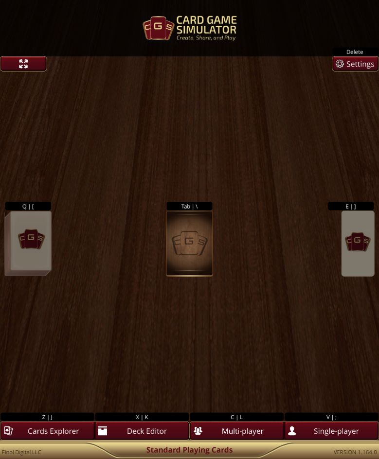
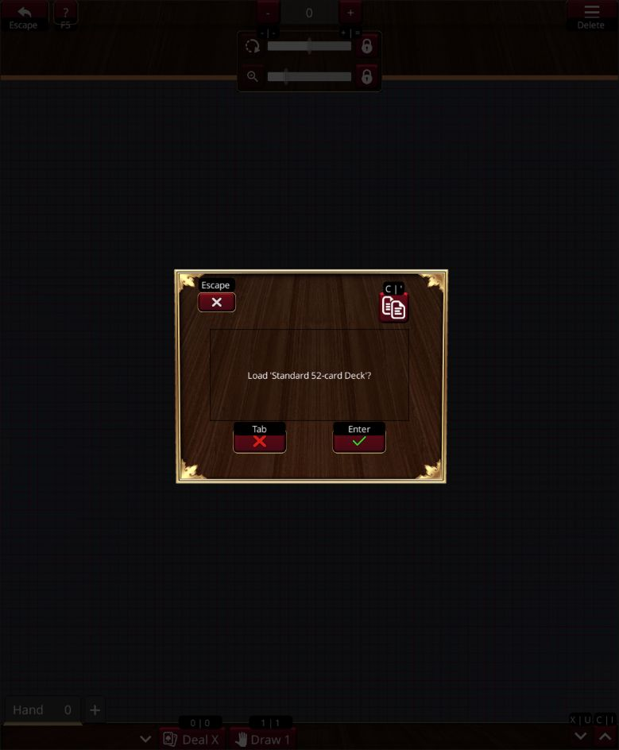
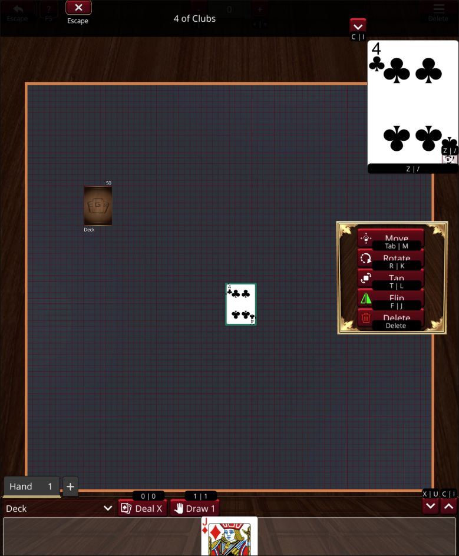
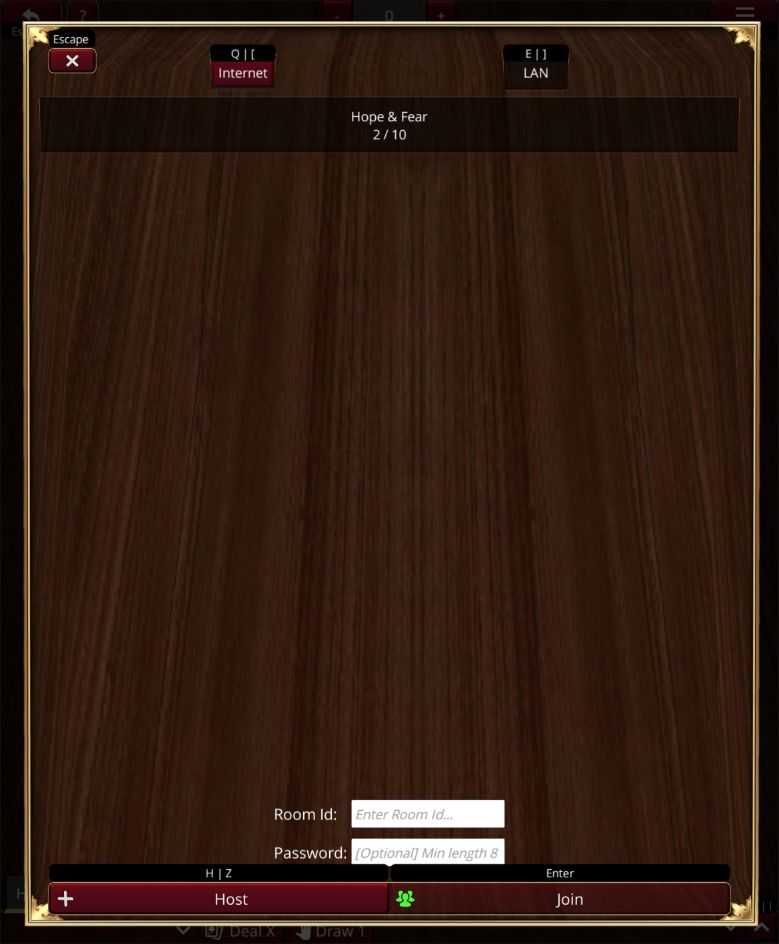

# How to play Card Game Simulator

**Card Game Simulator (CGS) does not require you to create an account or register to play, including online multiplayer.** Open the app, choose a game, and start playing.

CGS is a virtual tabletop: you move cards, manage your hand, and follow your chosen game's rules with the other players. A game may provide starting decks and a table setup, but CGS does not automatically enforce every game's rules or take turns for you.

[Open CGS in your browser](https://cgs.gg/) · [Download an app version](/) · [Plain Markdown version](/how-to-play.md)

## On this page

- [Do I need an account?](#do-i-need-an-account)
- [Try your first table](#try-your-first-table)
- [Play online with friends](#play-online-with-friends)
- [Mouse and touch controls](#mouse-and-touch-controls)
- [Hands, decks, and game rules](#hands-decks-and-game-rules)
- [Troubleshooting](#troubleshooting)

## Do I need an account?

**No. You do not need a CGS account, email address, or account password to play locally or online.** Internet multiplayer uses an automatic anonymous sign-in behind the scenes. You do not need to create a Unity account either.

- **Player name:** a display name for the table, not an account registration.
- **Room Id:** a code for joining a particular multiplayer session, not a user account or game identifier.
- **Room password:** an optional password chosen by the host for that session, not an account password.
- **App stores and community sites:** a store may require its own account to install an app; GitHub or Discord may require accounts to contribute or chat. Those are separate from playing CGS. The [browser app](https://cgs.gg/) lets you start without a CGS registration.

## Try your first table

This practice session uses **Standard Playing Cards**, included with CGS. It teaches the tabletop controls; you can then use them for a card game whose rules you know.

1. **Open CGS and select Standard Playing Cards.** On the main menu, use the game selector to choose it. Selecting a game chooses its cards and configuration; it does not join a multiplayer room.

   

   *Check the selected game name at the bottom, then choose Single-player for this practice session.*

2. **Choose Single-player** to start a local table. You should now see the play area and a deck-loading prompt.
3. **Load the starting deck.** Accept the prompt to load **Standard 52-card Deck**. If you open the deck list instead, select a deck and load it. Wait for any required download to finish. A deck stack should appear on the table.

   

   *Choose the green checkmark, or press Enter, to load the deck.*

4. **Put cards in your hand.** If a deal/draw prompt appears, set the number of cards and confirm. For practice, use two cards. Your hand is in the drawer at the bottom of the screen; open it to see your cards. Use **Deal X** to choose a hand size or **Draw 1** to draw one card from your play deck. On a keyboard, with no card selected or dialog open, the corresponding shortcuts are **0** and **1**.
5. **Play a card.** Drag one card from your hand onto an empty part of the table. Select it and use **Flip** in its action panel to turn it over. The card stays on the table and its displayed face changes.

   

   *After playing one of your two cards, one stays in your hand. Select the card on the table to show its actions, including Flip.*

6. **Practice taking a card from the deck.** Start dragging from the stack immediately to pull its top card onto the table. To move the whole stack, press and hold it for about half a second **before** dragging.

You have now loaded a deck, drawn a hand, and played a card. To play a full game, agree on its rules and starting hand size, then carry out those actions on the tabletop. For a discard pile, place cards where your group agrees it belongs; the **Delete** action removes a card rather than choosing a discard pile for you.

## Play online with friends

Everyone should use compatible CGS app versions and the same card game and game content. The **game name/ID** identifies what you are playing; the **Room Id** identifies the host's session. They are different.

*Choose Multi-player from the main menu to open this lobby. The host chooses Host; friends enter the host's code in Room Id and choose Join. The room list will vary. Screenshots show CGS 1.164.0; select any screenshot to enlarge it.*

### Host a table

1. Select the game on the main menu, then choose **Multi-player**. This opens the lobby for both hosting and joining.
2. Choose **Internet** in the lobby.
3. If you want a room password, enter one with **8–64 characters**, then choose **Host**. An invalid-length password is not applied; check any warning before sharing the room.
4. Once hosting has succeeded, share the **Room Id** displayed in the scoreboard area, plus the room password if you set one. Players should join this room instead of each creating their own table.
5. Follow the game's deck/setup prompts. A game with a shared deck may need only the host to load it; a game with individual decks needs each player's deck. Avoid loading duplicate shared decks.

### Join the host

1. Select the same game, choose **Multi-player**, and choose **Internet**.
2. Select the host's lobby from the list, or enter the code they shared in **Room Id**.
3. Enter the room password if required, then choose **Join**.
4. Confirm that you see the shared table and the other players in the scoreboard. Follow any prompts for your own deck or hand.
5. Try moving one card and ask a friend to confirm that they see it move. Once everyone is connected, follow your game's turn order and rules.

**On the same local network:** installed app versions can also host/join using **LAN**. Everyone must select LAN; join a discovered table or enter the host's local address in **Room IP**. Use **Internet** for browser play. Local network discovery and direct IP connections can depend on your network/firewall settings.

## Mouse and touch controls

These are the default controls in CGS 1.164. Game configuration, app version, and settings can change available actions. Open the **?** help button at the top left (**F5** on a keyboard) for controls appropriate to your device.

| Task | Mouse / keyboard | Touch |
| --- | --- | --- |
| Select a card | Left-click the card. | Tap the card. |
| Move a card | Left-click and drag. | Drag with one finger. |
| Inspect a card | Select it to use the card viewer. | Press and hold the card to zoom in. |
| Flip, rotate, or move a selected card | Use the card action panel. **F** flips, **T** taps/untaps, and **R** rotates when allowed. | Select the card, then use the action panel. |
| Take the top card from a stack | Start dragging immediately. | Start dragging immediately with one finger. |
| Move the entire stack | Hold for about half a second, then drag. | Hold for about half a second, then drag. |
| Pan the table | Middle-button drag or **Shift + left-button drag**. | Drag the play area with two fingers. |
| Zoom the table | **Ctrl + scroll wheel**, with zoom enabled. | Pinch with two fingers, with zoom enabled. |
| Rotate the table | **Ctrl + right-button drag**, with rotation enabled. | Twist with two fingers, with rotation enabled. |

A second click/tap on an already-selected card can perform its configured default action. Stack viewing on a second click/tap depends on **Double Click To View Stacks**. Select an object and use its visible action buttons when you are unsure what a repeated click will do.

## Hands, decks, and game rules

- **Hand:** the drawer at the bottom holds your cards. Drag cards out to play them or back in to return them to your hand. In multiplayer, other players do not see your hand's card faces through the normal table view; cards you play onto the table may be visible to them.
- **Deck stack:** a group of cards on the table. It can accept cards dropped onto it. Use the stack's shuffle action and confirm when your game's rules call for shuffling. Drawing uses your assigned play deck, so an empty or missing play deck will not produce a card.
- **Additional decks:** open the play menu's deck-loading option to load another deck for the selected game. Deck files must match that game's cards.
- **Other games:** use the game selector or [Games Management guide](https://github.com/finol-digital/Card-Game-Simulator/wiki/Games-Management); find community content at [CGS Games](https://cgs.games/). Agree with friends on the same content before joining.
- **Rules:** use the chosen game's rulebook for turn order, legal moves, scoring, and winning. CGS supplies the table and pieces; this guide explains how to operate them.

## Troubleshooting

| What you see | What to try |
| --- | --- |
| A blank table or no cards to draw | Load a starting deck or a compatible deck for the selected game. Let downloads finish and check any error message. |
| A stack moves when you wanted one card | Begin dragging sooner; holding first moves the whole stack. |
| One card moves when you wanted the stack | Hold the stack still for about half a second before dragging. |
| The table will not zoom or rotate | Check the zoom/rotation toggles in the in-game help panel. |
| A lobby is missing or joining fails | Confirm Internet versus LAN, the current Room Id/IP, any password, and matching game content. Ask the host to confirm the room is still open. A game ID is not a Room Id. |
| Cards or decks differ between players | Check the CGS app version and game content on every device. Custom games without automatic updates may need the same game archive installed by each player. |
| Only the host can move cards | This is not a registration requirement. Try the same action locally, note whether selection or dragging fails, and report both players' app versions, devices, game, and connection type. |

For help, use [CGS support](/contact/). Include the action you tried, what happened, and what you expected. Do not post an active room code or room password in a public bug report.
