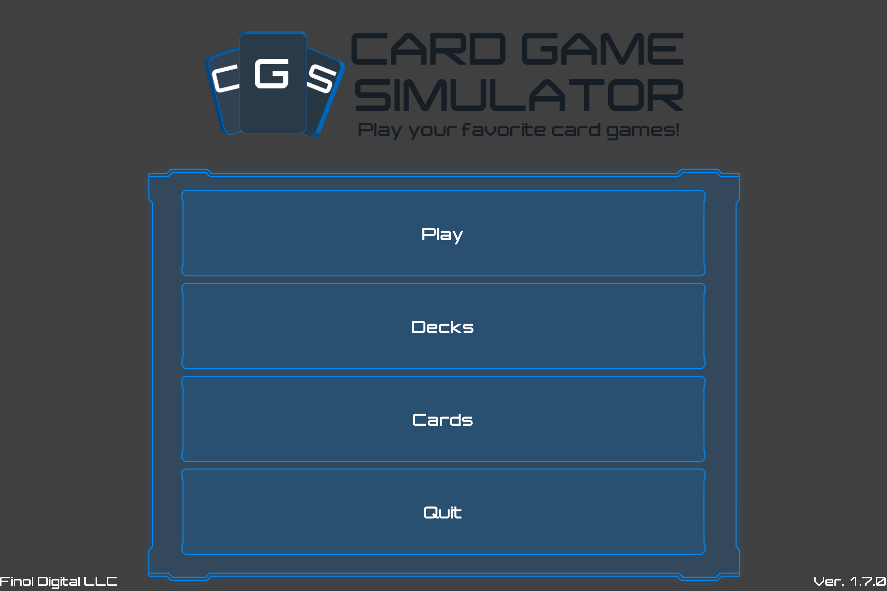
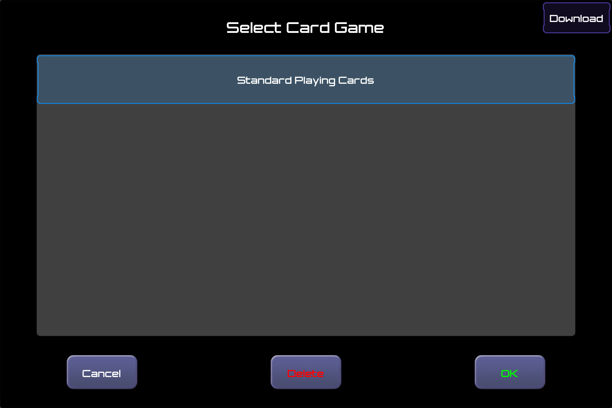
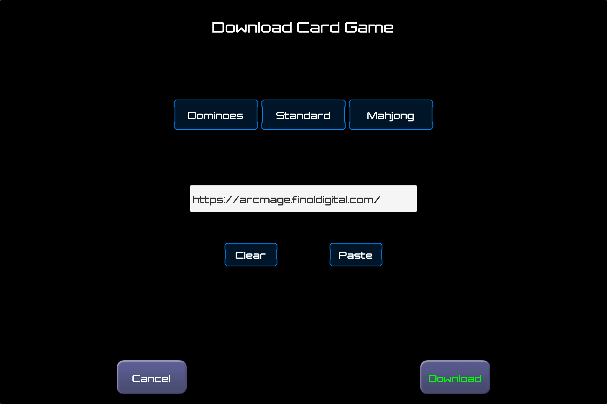

# Play Anywhere
- Android via [Google Play](https://play.google.com/store/apps/details?id=com.finoldigital.cardgamesim)
- iOS via the [App Store](https://itunes.apple.com/us/app/card-game-simulator/id1392877362?ls=1&mt=8)
- Mac via the [Mac App Store](https://itunes.apple.com/us/app/card-game-simulator/id1398206553?ls=1&mt=12)
- Windows via the [Microsoft Store](https://www.microsoft.com/store/apps/9N96N5S4W3J0)

## Create & Share Custom Games
With CGS, users can create and share their own custom card games!

You can select card games by tapping the top banner of the Main Menu:

In the Game Selection Menu, you can manage your card games.

You can tap on the "Share" button to create a CGS Deep Link that you can send to other people, so that they can click on it and get access to that card game:

You can also tap the "Download" button in the top-right to manually enter the CGS AutoUpdate URL for the game you would like to download.

For example, the CGS AutoUpdate URL for [Arcmage](https://arcmage.org/) is: https://arcmage.finoldigital.com/

You can also create your own custom game(s) by following the [Custom Games Documentation](custom.html).

## Use CGS

[Click here for a tutorial video!](https://youtu.be/pFaHJ2QTYuo)

When you play a game in CGS, CGS hosts game sessions in your Local Area Network (LAN), meaning that anyone on the same wifi as you should be able to join your game.

When joining a friend's game session, CGS will be set to use the same card game that the host has selected. If you do not already have that card game, CGS will automatically download it.

When navigating through CGS, you may find it useful to use [keyboard shortcuts](keyboard.html).

## Feedback
See the [current roadmap](roadmap.html). Please send any additional feature requests/bug reports/other feedback to <david@finoldigital.com> or [contact us on facebook](https://www.facebook.com/cardgamesimulator/).

*You may also be interested in our [Privacy Policy](PRIVACY.html).*
