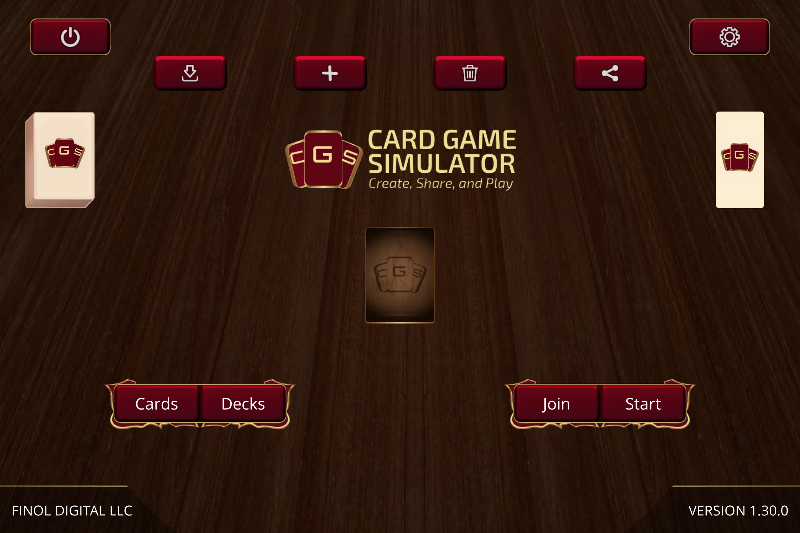
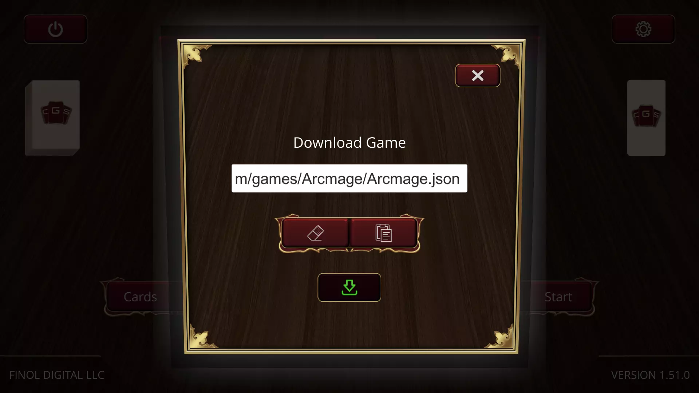

# Play Anywhere
- PC via Steam *(Coming Soon!)*
- Android via [Google Play](https://play.google.com/store/apps/details?id=com.finoldigital.cardgamesim)
- iOS via the [App Store](https://itunes.apple.com/us/app/card-game-simulator/id1392877362?ls=1&mt=8)
- OSX via the [Mac App Store](https://itunes.apple.com/us/app/card-game-simulator/id1398206553?ls=1&mt=12)
- Windows via the [Microsoft Store](https://www.microsoft.com/store/apps/9N96N5S4W3J0)
- Web via [Unity WebGL](cgs-webgl.html) *(experimental)*

## Create & Share Custom Games
With CGS, users can create and share their own custom card games!

You can mange your card games by tapping the center card game in the Main Menu:

You can then tap on the "Share" button to create a CGS Deep Link that you can send to other people, so that they can click on it and get access to that card game.
For example, the CGS Deep Link for [Arcmage](https://arcmage.org/) is: [https://cgs.link/arcmage](https://cgs.link/arcmage)

You can also tap the "Download" button to manually enter the CGS AutoUpdate URL for the game you would like to download.
For example, the CGS AutoUpdate URL for Arcmage is: https://www.cardgamesimulator.com/games/Arcmage/Arcmage.json

You can also create your own custom game(s) by following the [Custom Games Documentation](custom.html).

## How to Play



When navigating through CGS, you may find it useful to use [keyboard shortcuts](keyboard.html).

## Feedback
See the [current roadmap](roadmap.html). Please send any additional feature requests/bug reports/other feedback to <david@finoldigital.com> or [contact us on Facebook](https://www.facebook.com/cardgamesimulator/). 
We're also on [Discord](https://discord.gg/MdUHEUJCU4), [Twitter](https://twitter.com/cardgamesim), and [Reddit](https://www.reddit.com/r/CardGameSimulator/).
We encourage you to check out [these other projects](external.html).

*You may also be interested in our [Privacy Policy](PRIVACY.html).*
